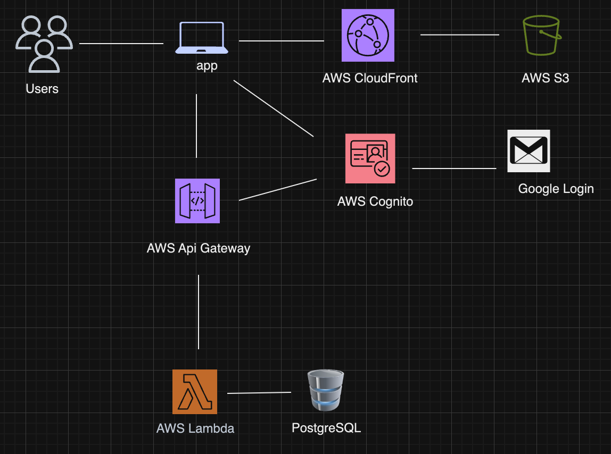

# Estilo Calico Admin Portal Backend


[Estilo Calico Admin Portal](https://admin.estilocalico.com) is a custom cloud-based content management system.

Deployed in AWS, React frontend, Python/Flask backend, Terraform for infrastructure as code.

## How the CMS works
The Estilo Calico Admin Portal allows users to manage and administer content of the [Estilo Calico](https://wwww.estilocalico.com) website.

## Architecture


## Running the server
To start flask with hot reloading 

```bash
flask --app app.py --debug run
```

## Testing
The flask app exposes an http API. In order to test this API we need a tool that is capable of making requests with all of the http verbs. Browsers make GET requests when an url is entered into the search bar thus we need a tool that can allow us to test other http verbs (PUT, PATCH, DELETE, POST).

Use Postman for testing http requests. Go to Estilo Calico collection and choose environment to test. To access variables in your environment use {{ VARIABLE NAME }}. Path params are added with a colon (an example is `/:id`). Path variable section will appear in Postman and you can put the corresponding value there. Look at the "Delete event" request for an example. The collection is in account associated with my email. 

Could've chosen curl as well. 

## Installation/setup
- Clone the repo
- Make sure you are running Python 3.9 for this project
- Install dependencies `pip3 install -r requirements.txt`

### Set up postgreSQL database
Set up postgreSQL in your provider of choice. Add the following environment variables to your project. 
| NAME         | DESCRIPTION                                                         |
|--------------|---------------------------------------------------------------------|
| DB_URI       | link to your database                                               |
| DB_USER      | your username                                                       |
| DB_PASSWORD  | your password                                                       | 
| DB_HOST      | hostname or IP address of the server where your dababase is running |
| DB_PORT      | port number on which PostgresSQL server is listening                |

### Database migrations
The database schema is set up in the `db_migrate.py` file. To create your tables run the following command `python3 db_migrate.py`

## Test Frontend and Backend locally
To test the frontend and backend locally clone the [Estilo Calico Admin Portal frontend repo](https://github.com/c-arriagada/es-admin). Follow the README to set up your frontend. Start your flask server. 
```bash
flask --app app.py --debug run
```
After you've started your server start your React application.
```bash
npm start
```

## Deployment

#### Set up cloud infrastructure
See [cloudInfrastructure.md](docs/cloudInfrastructure.md)

#### Run scripts
`./bin/build_lambda.sh && ./bin/deploy_lambda.sh`

The build_lambda.sh script creates a `estilo_calico_backend_updated.zip` file that contains all of the files needed to run your backend. Per AWS documentation the file that has your lambda handler has to be at the root of your .zip file. 

The deploy_lambda.sh file uploads your .zip file to your AWS Lambda. 

`./bin/build_lambda_layer.sh`

The above script creates a layer with the dependencies needed to run your backend `estilo-calico-deps-layer.zip`. This .zip file is uploaded to your Lambda layer when you run Terraform. See [Deploying Flask Backend to AWS](https://meowing-opal-7f5.notion.site/Deploying-Flask-Backend-to-AWS-8a55448dc2c749bda00c9be0e8309180) for an explanation as to why I created this script. 

